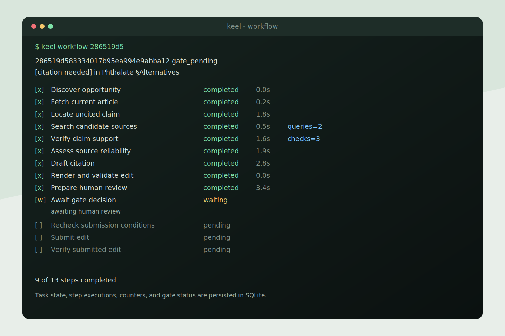
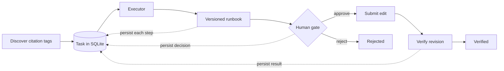

# Keel

Keel turns Wikipedia `[citation needed]` tags into durable, human-reviewed tasks.
Each task follows a versioned runbook whose steps, decisions, retries, and target
revisions are persisted and visible to the operator.



The current target is `test.wikipedia.org`. Keel discovers citation gaps, researches
candidate sources with an LLM, renders a deterministic edit, waits for human approval,
submits the edit, and verifies the resulting revision.

## Quick start

Keel requires Python 3.12 or newer.

```bash
git clone git@github.com:roycclu/keel.git
cd keel

uv venv .venv
uv pip install --python .venv/bin/python -e '.[dev]'
source .venv/bin/activate

cp .env.example .env
$EDITOR .env
```

At minimum, configure OpenAI and Brave Search:

```dotenv
KEEL_LLM_API_KEY=<openai-api-key>
KEEL_WEB_SEARCH_API_KEY=<brave-api-key>
```

Discover work and advance it to the human gate:

```bash
keel discover --limit 5
keel run --max-steps 10
keel status
```

Inspect one task and watch its runbook progress:

```bash
keel workflow <task-id>
keel workflow <task-id> --watch
keel workflow <task-id> --json
```

Review proposed edits interactively:

```bash
keel review --reviewer alice
```

Approved tasks become actionable. Run the executor again to submit and verify them:

```bash
keel run --max-steps 10
```

Use `--dry-run` when you want to exercise submission without posting to Wikipedia.
Live submission requires `KEEL_WIKI_OAUTH_TOKEN`; research and review do not.

## How it works



The executor does not ask an open-ended agent what to do next. It loads the oldest
actionable task, selects the runbook branch for the task's current state, executes that
branch, and persists the result with optimistic locking.

### Runbooks

A runbook is a named, versioned state transition. The Wikipedia implementation is
[`WikipediaCitationWorkflow`](keel/runbooks/wikipedia_citation.py). Its `advance`
method has three executable branches:

| Starting state | Runbook branch | Result |
| --- | --- | --- |
| `discovered` | Research, verify evidence, draft, render | `gate_pending`, `abandoned`, or `failed` |
| `approved` | Recheck the article and submit the edit | `submitted`, `abandoned`, or `failed` |
| `submitted` | Verify the target revision | `verified`, `reverted`, or `failed` |

Human review sits between the first and second branches. Approval moves a task from
`gate_pending` to `approved`; rejection moves it to the terminal `rejected` state.

### Steps

A step is one persisted, operator-visible execution inside a runbook. The workflow
declares 13 stable step specifications:

| Phase | Steps |
| --- | --- |
| Discovery | Discover opportunity |
| Research | Fetch article, locate claim, search sources, verify support, assess reliability |
| Draft | Draft citation, render and validate edit, prepare human review |
| Gate | Await gate decision |
| Submit | Recheck submission conditions, submit edit |
| Verify | Verify submitted edit |

Step executions record state, timing, detail, and repetition count. Repetition counters
describe work performed inside a task:

- `queries=N` is the number of source-search queries.
- `candidates=N` is the number of candidate sources assessed for reliability.
- `checks=N` is the number of claim-support checks.
- `retry attempt N` is separate and appears only after a transient workflow failure.

The defaults are five citation tasks per scanned page, five fully assessed source
candidates per task, and three total attempts for a transient operation, including the
initial attempt. See [`.env.example`](.env.example) for the corresponding limits.

## Operator workflow

A normal run is a short control loop:

```bash
# 1. Create durable tasks from citation-needed tags.
keel discover --limit 5 --tags-per-page 5

# 2. Research and draft until tasks reach a gate or terminal state.
keel run --max-steps 10

# 3. Inspect the queue and one task's complete runbook.
keel status
keel workflow <task-id>

# 4. Approve, reject, or skip each proposed edit.
keel review --reviewer alice

# 5. Submit approved work and verify resulting revisions.
keel run --max-steps 10
```

`--max-steps` limits workflow advances, not the internal source checks shown by
`keel workflow`. A gate-pending task is intentionally not actionable until a reviewer
records a decision.

## Architecture

| Component | Responsibility |
| --- | --- |
| [`Executor`](keel/runbooks/executor.py) | Select actionable tasks, enforce retry scheduling, persist each advance |
| [`WikipediaCitationWorkflow`](keel/runbooks/wikipedia_citation.py) | Declare steps and implement state-specific runbook branches |
| [`SqliteStateStore`](keel/store/sqlite_store.py) | Persist tasks, transitions, retries, and step executions with compare-and-swap updates |
| [`skills`](keel/skills) | Perform schema-validated LLM reasoning without network or target credentials |
| [`tools`](keel/tools) | Perform typed search, fetch, rendering, and target API operations |
| [`WikipediaTarget`](keel/wikipedia/target.py) | Parse opportunities, enforce target policy, render payloads, and submit edits |
| [`observability`](keel/observability) | Emit JSONL or OpenTelemetry-native Langfuse traces |

The capability boundary is explicit:

- A `SkillContext` contains the LLM but no HTTP client or target credentials.
- A `ToolContext` contains HTTP and target authentication but no LLM.
- Only the approved submit branch can reach the side-effecting Wikipedia write tool.
- SQLite is the source of truth; traces explain execution but do not control it.

For the complete type system, state graph, plugin protocols, and design rationale, see
[`ARCHITECTURE.md`](ARCHITECTURE.md). For repository coding rules, see
[`AGENTS.md`](AGENTS.md).

## Configuration

Keel defaults to the OpenAI Chat Completions API and accepts any compatible provider
through `KEEL_LLM_BASE_URL`. Brave LLM Context is the default retrieval mode; standard
Brave Web Search can be selected with `KEEL_WEB_SEARCH_MODE=web`.

Common settings:

| Variable | Purpose |
| --- | --- |
| `KEEL_LLM_API_KEY` | LLM authentication |
| `KEEL_LLM_MODEL` | Structured-reasoning model |
| `KEEL_WEB_SEARCH_API_KEY` | Brave Search authentication |
| `KEEL_DISCOVERY_TAGS_PER_PAGE` | Maximum tasks created per scanned page |
| `KEEL_RESEARCH_CANDIDATE_LIMIT` | Maximum candidate sources assessed per task |
| `KEEL_OPERATION_MAX_ATTEMPTS` | Total attempts allowed for transient failures |
| `KEEL_SQLITE_PATH` | Durable SQLite task store |
| `KEEL_WIKI_OAUTH_TOKEN` | Required only for live submission |
| `KEEL_OBSERVABILITY_BACKEND` | `jsonl` or `langfuse` |

## Observability

Set the following values to export OpenTelemetry-native traces to Langfuse:

```dotenv
KEEL_OBSERVABILITY_BACKEND=langfuse
LANGFUSE_PUBLIC_KEY=pk-lf-...
LANGFUSE_SECRET_KEY=sk-lf-...
LANGFUSE_BASE_URL=https://cloud.langfuse.com
LANGFUSE_TRACING_ENVIRONMENT=development
```

List the deterministic trace IDs associated with a task:

```bash
keel traces <task-id>
```

Ask a focused question about a retained decision:

```bash
keel investigate <task-id> \
  --question "Why did the workflow reject these sources?"
```

## Development

```bash
pytest
```
